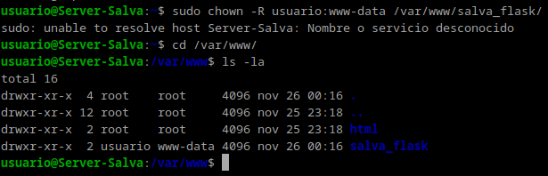

# Práctica 3.5: Despliegue de una aplicación Flask (Python)

## Prerrequisitos

Para comenzar con la práctica, es necesario tener instalado en el sistema los siguientes paquetes:
- Nginx
- Gunicorn
- Pipenv

## Despliegue de la aplicación de prueba

Empezamos instalando pipenv:

Ahora debemos de cambiar los propietarios de la carpeta de la aplicación:

Así como los permisos:

Creamos el archivo .env dentro de la carpeta de la aplicación y añadimos las variables de entorno necesarias:

Contenido del archivo .env:

Inicializamos el entorno virtual de la aplicación:

Ahora instalamos las dependencias de la aplicación:

Creamos los archivos app.py y wsgi.py:

Contenido del archivo wsgi.py:

Probamos la aplicación:

Vemos que funciona:

Ahora comprobamos que gunicorn funciona correctamente:

Veremos cual es el path de gunicorn dado que lo necesitaremos para configurar systemd.
Acto seguido saldremos del entorno virtual e iniciaremos nginx:

Iniciamos nginx:

Ahora creamos el archivo de configuración para que systemd ejecute gunicorn:

Comprobamos que el servicio se ha creado correctamente:

Ahora configuramos nginx:

Activamos el servidor nginx con el enlace simbólico:

Comprobamos que el servicio de nginx se ha creado correctamente:

Cambiamos el archivo /etc/host para que la dirección IP de la máquina física apunte a la dirección IP de la máquina virtual:

Y vemos que la aplicación funciona correctamente:

## Despliegue de la aplicación

Ahora debemos repetir todos los pasos anteriores pero con la aplicación https://github.com/raul-profesor/Practica-3.5 . Por ello, iré un poco más rápido.

Después de clonar el repositorio, creamos el archivo .env:

Le damos los permisos necesarios y cambiamos el propietario:

Inicializamos el entorno virtual:

Probamos la aplicación:

Comprobamos que gunicorn funciona correctamente:

Creamos el archivo de configuración para systemd:

El archivo de configuración de nginx:

Habilitamos el servicio de nginx:

Hacemos el enlace simbólico:

Volvemos a cambiar el archivo /etc/hosts:

Y comprobamos que la aplicación funciona correctamente:

